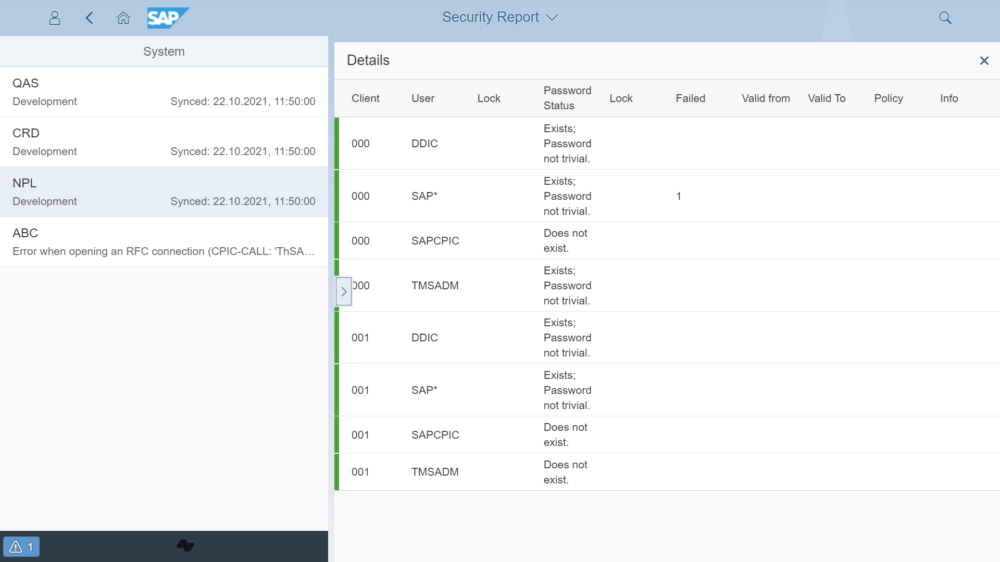

# Password checks

The password checks use standard report *RSUSR003 - Check the Passwords of Standard Users*. The report is used to make sure that the user SAP* has been created in all clients and that the standard passwords have been changed for *SAP*, *DDIC*, *SAPCPIC*, and *EARLYWATCH* users. At a glance, report RSUSR003 can tell us that all these users are properly maintained or not.

