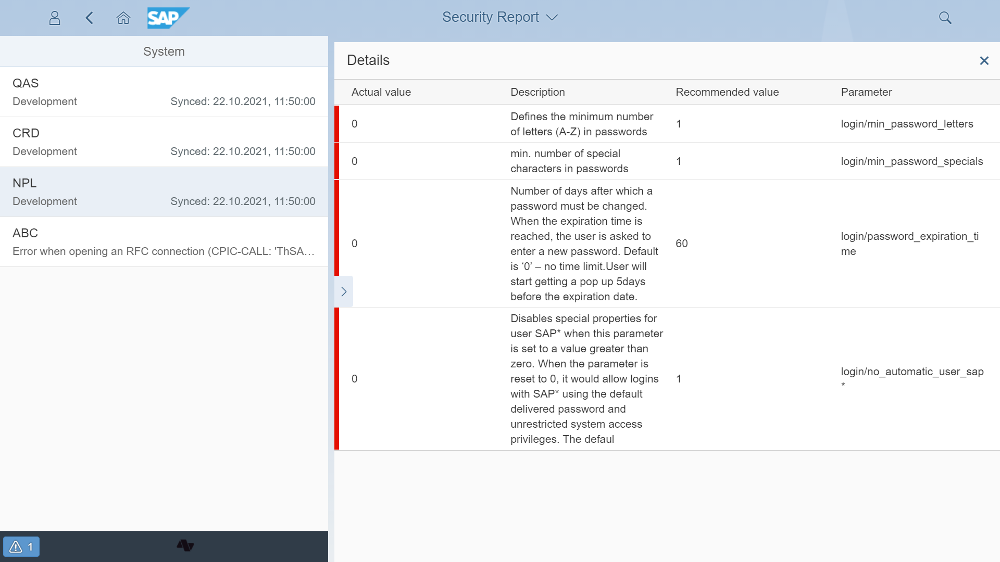

# Security parameters check

Parameter control verifies the values of parameters related to the security of SAP systems. The check comes with the set of recommended values that affect systems security. In the next version, Gover will store the parameters as ["To-be" records](../to-be.md), allowing the user to adopt proposed values.

