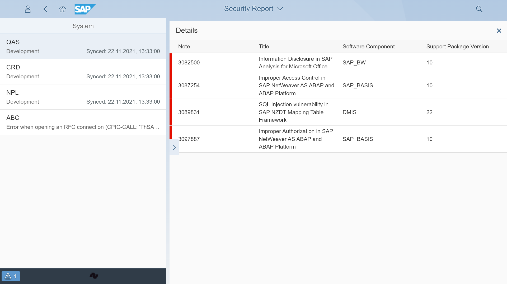

# Security patches

Security patches check verifies whether your SAP systems contain latest security fixes. If there is no patch installed in your system for a vulnerability published by SAP, the check will indicate the required note.

