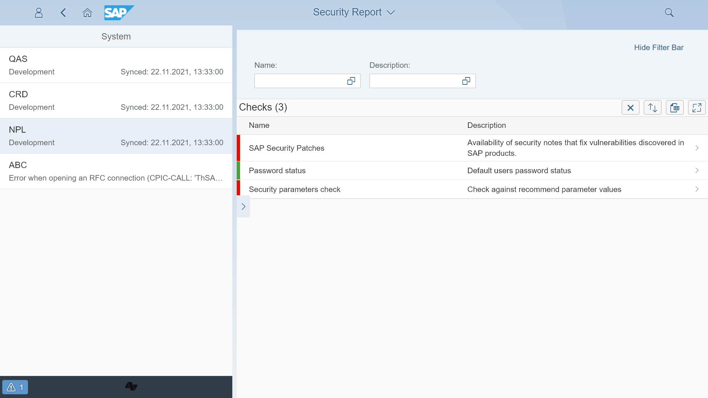

# Overview

Gover is a solution that enables [security checks](sec-checks.md) for your SAP system landscape. All the checks available in Gover are optional. The user can choose what type of checks are going to be performed.

You can choose the system for which you would like to see the checks.

## [Installation](inst.md)

## Location
Located on Central system

## Available extensions
[Fiori Tracker Core](extend-w-core.md)

## [Configuration](conf.md)
