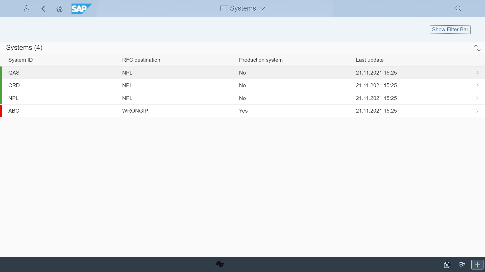
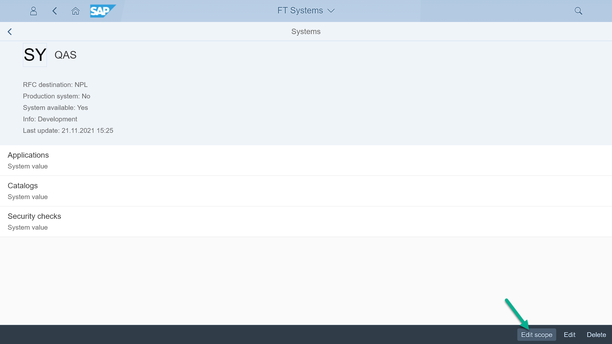
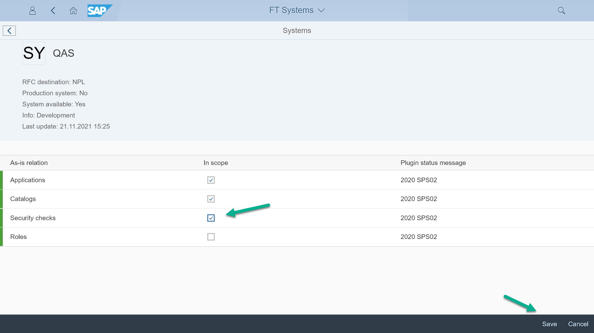

# Step 6 - Enable As-is relation: "Security checks" as in scope

1. In your Fiori Launchpad start the app *Manage Systems* from *As-is Main API* group. 

2. Chose the system for which you want to enable the security checks and press the button *Edit scope*

2. Mark the check-box for *Security checks* and press *Save* 

