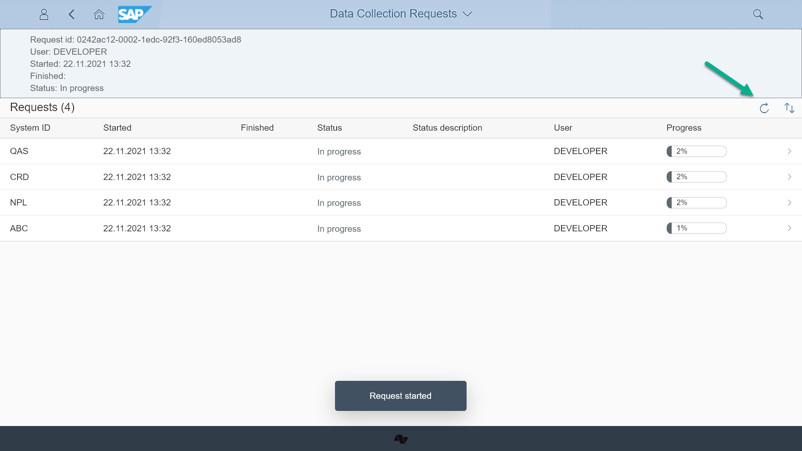

# Step 7 - Complete the first time data synchronization from managed systems

1. In your Fiori Launchpad start the app *Data Collection Reqests* from *As-is Main API* group and press the button *Create request*

2. Pressing the button will start the syncronization. To see the progress press the button with refresh icon.

2. Once the synchronization is finished you will see the "Completed" status in respective column.

