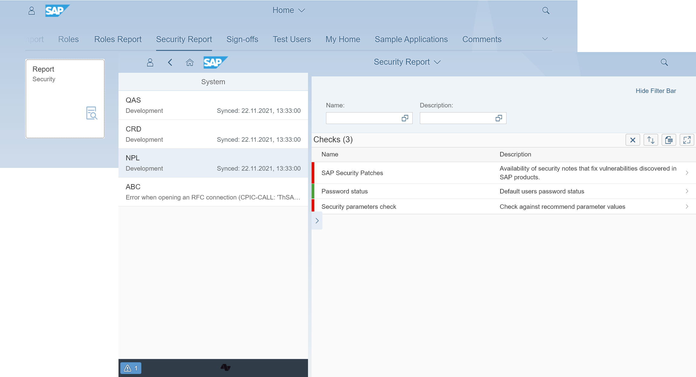

# Gover
Prevent SAP systems security threads with automated checks.

# Key features
The following are the key features of Gover:

-   One-stop access to security checks for each of your SAP systems
-   SAP system dedicated and expandable security [checks list](2020/FPS01/sec-checks.md)
-   Automation of regular system security checks

# Benefits
The following are the key benefits:

-   Quickly discover SAP system vulnerabilities
-   Save time on repetitive tasks

